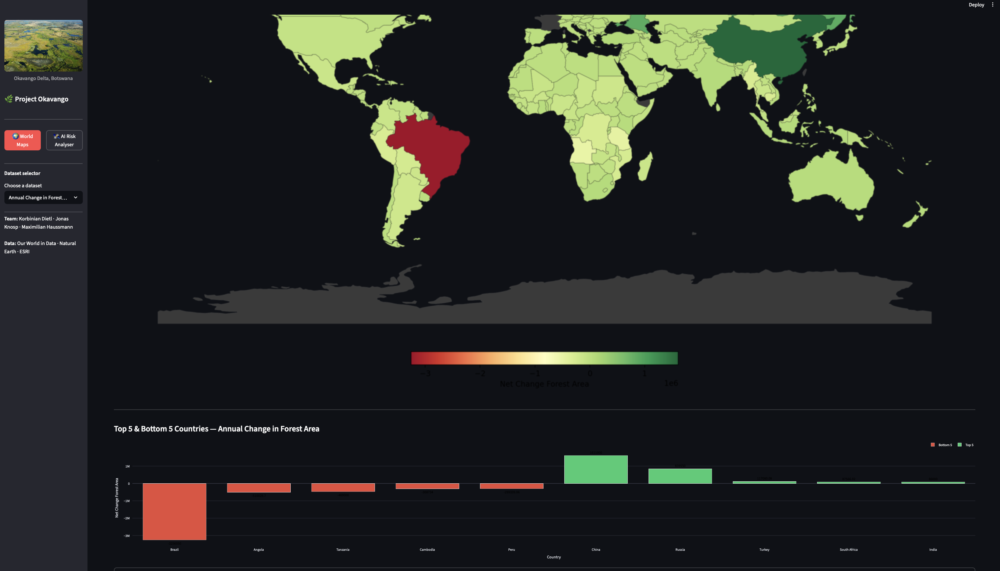
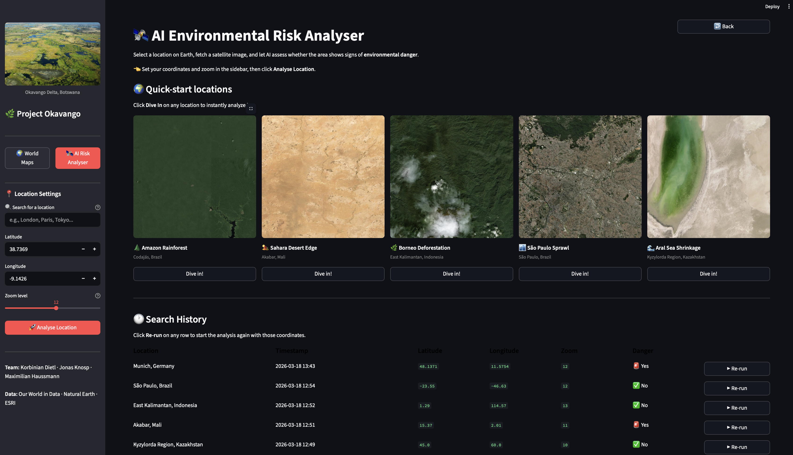
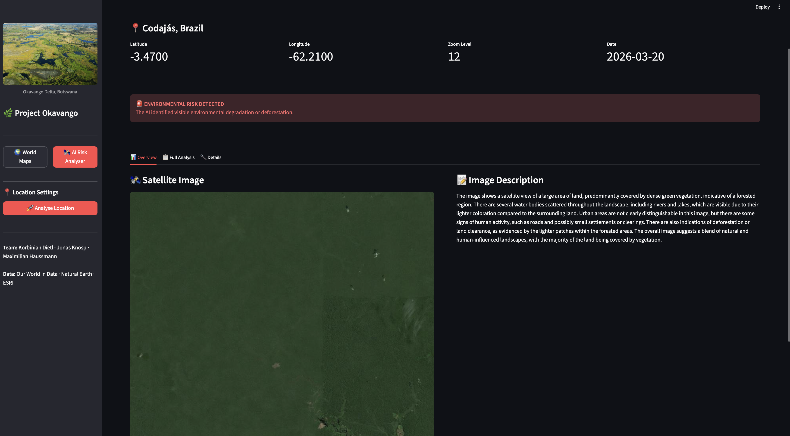
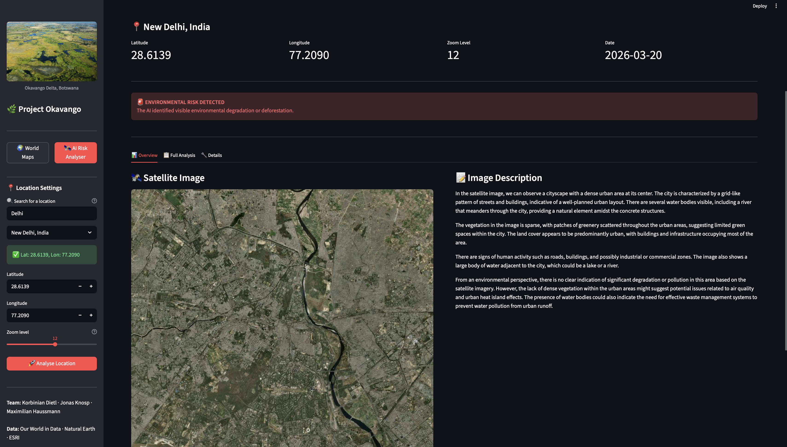
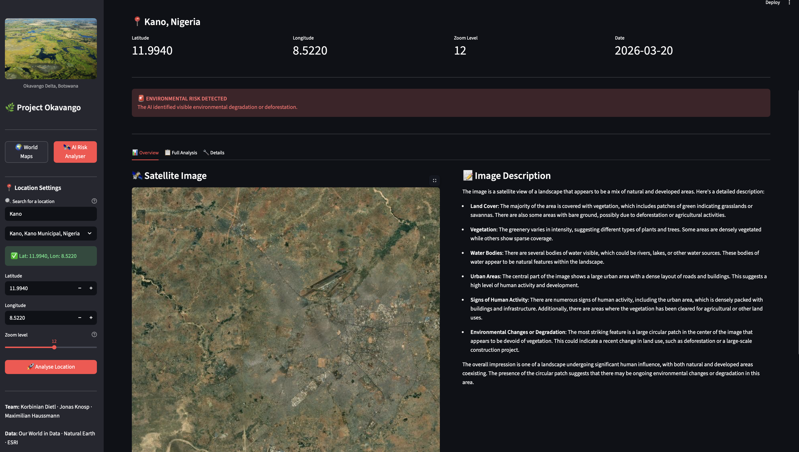

# AdvancedProgramming_GroupProject

**Team Members**:

Korbinian Dietl: 70124@novasbe.pt  
Jonas Knosp: 72128@novasbe.pt  
Maximilian Haussmann: 72633@novasbe.pt

## Introduction:

Interactive world maps and AI-powered satellite image analysis for environmental monitoring.

**Interactive world maps showing data for:**
* Annual forest area change
* Annual deforestation rates
* Share of land protected
* Share of land degraded
* Forest area as % of land

**Features**:
* Dynamic dataset selector
* Choropleth maps
* Top/bottom 5 countries charts
* AI Analyzer: download satellite tiles, generate natural-language image descriptions, and assess environmental risk using local Ollama models (e.g., llava, llama3)
* Coordinate and zoom selector, plus location search with autocomplete and reverse geocoding
* Caching of analyzed images and results (database/images.csv) and local image storage (images/)
* Configurable models and tile settings via `models.yaml`

## Running Streamlit App

**Run it**:

Step 1: Create and activate a virtual environment (optional but recommended):
```bash
python -m venv .venv
source .venv/bin/activate  # On Windows: .venv\Scripts\activate
```

Step 2: Install dependencies:
```bash
pip install -r requirements.txt
```

Step 3: From the project root directory run either:
```bash
streamlit run main.py

# or
python main.py
```

Step 4: Run tests (optional):
```bash
python -m pytest
```

### Data / Outputs

- **images/**: stored satellite images generated by the AI Analyzer.
- **images_quicksearch/**: pre-saved quicksearch images used as fallbacks.
- **database/images.csv**: analysis cache and metadata — the app checks this CSV before re-running the AI pipeline to avoid duplicate work.

### Screenshots / Examples

### **Interactive World Maps**


### **AI Environmental Risk Analyser**


### Configuration & External Tools

The AI Analyzer uses local Ollama models and a small `models.yaml` for settings. Also the app uses the OpenCage API for location lookups. Set your API key as an environment variable `OPENCAGE_API_KEY` or edit the file directly (not recommended for production).

Quick Ollama notes:
- Install Ollama from https://ollama.com/ and ensure `ollama` is in your PATH.
- Pull the models used by the app (example):
```bash
ollama pull llava:7b
ollama pull llama3.2:3b
```

Example `models.yaml` (place at project root):
```yaml
image_analysis:
	model: "llava:7b"
	prompt: "Describe this satellite image in detail from an environmental perspective."
	temperature: 0.3
	max_tokens: 512

risk_assessment:
	model: "llama3.2:3b"
	prompt: "Given this satellite image description, answer YES or NO: Is there visible environmental danger (deforestation, degradation, pollution)? Reply with: DANGER: YES/NO and SUMMARY: <one sentence>."
	temperature: 0.1
	max_tokens: 256

tile_settings:
	tile_url: "https://server.arcgisonline.com/ArcGIS/rest/services/World_Imagery/MapServer/tile/{z}/{y}/{x}"
	tile_size: 256
	default_zoom: 12
	default_lat: 48.8566
	default_lon: 2.3522
	grid_size: 3
```

## Project Okavango and the UN Sustainable Development Goals (SDGs)

Project Okavango is a highly technical effort that connects raw environmental data (Part 1) with real-time, AI-powered visual monitoring (Part 2). The project's primary goal is to transform complex environmental data into meaningful and accessible visualizations to raise awareness of global threats to nature.
In the first stage, we analyze environmental changes across countries worldwide using raw datasets. Key indicators include annual changes in forest area, deforestation rates, the percentage of protected and degraded land, and forest area as a percentage of total land. We then generate a global heat map that highlights environmental risk levels and complement it with bar charts displaying the top and bottom five countries based on these metrics.
A central challenge in environmental monitoring is that many critical regions are remote and difficult to observe manually. Our project addresses this challenge by integrating environmental data with satellite imagery to enable a data-driven, scalable assessment of ecological threats. This approach enables us to evaluate environmental conditions in nearly any region of the world fully automatically.
Project Okavango aligns with several of the 17 United Nations Sustainable Development Goals (SDGs). Most notably, it contributes to Goal 15, Life on Land, by using satellite imagery and environmental data to monitor deforestation, land degradation, and protected areas. The project also supports Goal 13: Climate Action by providing insights into changes in carbon sequestration through tracking forest loss. Additionally, Project Okavengo supports Goal 9: Industry, Innovation, and Infrastructure by using advanced local AI technologies to address environmental challenges independently of large-scale infrastructure.
The AI workflow operates through a seamless "risk detection" pipeline that converts geographical coordinates into actionable insights. First, high-resolution satellite imagery is retrieved via ESRI services. The visual data is then processed by a local vision model, such as LLaVA, which generates detailed natural-language descriptions. A second large language model subsequently analyzes these descriptions to assess environmental risk factors.
Leveraging local models through Ollama keeps the system fully private, cost-efficient, and independent of external APIs. This design allows the solution to operate in remote or disconnected environments and provides a robust, secure framework for real-time environmental monitoring.


### AI in Action: Identifying Environmental Dangers

Below are three examples where our AI workflow successfully identified at-risk regions:

#### 1. Deforestation in the Amazon (Codajás, Brazil)

*   **AI Assessment:** "The image shows a satellite view of a large area of land, predominantly covered by dense green vegetation, indicative of a forested region. There are several water bodies scattered throughout the landscape, including rivers and lakes, which are visible due to their lighter coloration compared to the surrounding land. Urban areas are not clearly distinguishable in this image, but there are some signs of human activity, such as roads and possibly small settlements or clearings. There are also indications of deforestation or land clearance, as evidenced by the lighter patches within the forested areas. The overall image suggests a blend of natural and human-influenced landscapes, with the majority of the land being covered by vegetation."
*   **Coordinates:** -3.47, -62.21

#### 2. Urban Encroachment (New Delhi, India)

*   **AI Assessment:** "In the satellite image, we can observe a cityscape with a dense urban area at its center. The city is characterized by a grid-like pattern of streets and buildings, indicative of a well-planned urban layout. There are several water bodies visible, including a river that meanders through the city, providing a natural element amidst the concrete structures.
The vegetation in the image is sparse, with patches of greenery scattered throughout the urban areas, suggesting limited green spaces within the city. The land cover appears to be predominantly urban, with buildings and infrastructure occupying most of the area.
There are signs of human activity such as roads, buildings, and possibly industrial or commercial zones. The image also shows a large body of water adjacent to the city, which could be a lake or a river.
From an environmental perspective, there is no clear indication of significant degradation or pollution in this area based on the satellite imagery. However, the lack of dense vegetation within the urban areas might suggest potential issues related to air quality and urban heat island effects. The presence of water bodies could also indicate the need for effective waste management systems to prevent water pollution from urban runoff."
*   **Coordinates:** 28.61, 77.21

#### 3. Land Degradation (Kano, Nigeria)

*   **AI Assessment:** "The image is a satellite view of a landscape that appears to be a mix of natural and developed areas. Here's a detailed description:
Land Cover: The majority of the area is covered with vegetation, which includes patches of green indicating grasslands or savannas. There are also some areas with bare ground, possibly due to deforestation or agricultural activities.
Vegetation: The greenery varies in intensity, suggesting different types of plants and trees. Some areas are densely vegetated while others show sparse coverage.
Water Bodies: There are several bodies of water visible, which could be rivers, lakes, or other water sources. These bodies of water appear to be natural features within the landscape.
Urban Areas: The central part of the image shows a large urban area with a dense layout of roads and buildings. This suggests a high level of human activity and development.
Signs of Human Activity: There are numerous signs of human activity, including the urban area, which is densely packed with buildings and infrastructure. Additionally, there are areas where the vegetation has been cleared for agricultural or other land uses.
Environmental Changes or Degradation: The most striking feature is a large circular patch in the center of the image that appears to be devoid of vegetation. This could indicate a recent change in land use, such as deforestation or a large-scale construction project.
The overall impression is one of a landscape undergoing significant human influence, with both natural and developed areas coexisting. The presence of the circular patch suggests that there may be ongoing environmental changes or degradation in this area."
*   **Coordinates:** 11.99, 8.52


## Data Sources: 
Food and Agriculture Organization of the United Nations (2025) – with major processing by Our World in Data. “Annual change in forest area” [dataset]. Food and Agriculture Organization of the United Nations, “Global Forest Resources Assessment 2025” [original data].

Food and Agriculture Organization of the United Nations (2025) – with major processing by Our World in Data. “Deforestation” [dataset]. Food and Agriculture Organization of the United Nations, “Global Forest Resources Assessment 2025” [original data].

Food and Agriculture Organization of the United Nations (FAO) (2026) – processed by Our World in Data.
“Forest area (% of land area)” [dataset]. FAO, “Global Forest Resources Assessment” [original data].

Natural Earth. (n.d.). Admin 0 – Countries (1:110m Cultural Vectors) [Dataset]. Retrieved March 20, 2026, from https://www.naturalearthdata.com/downloads/110m-cultural-vectors/

Protected Planet WDPA and WD-OECM data, UNEP-WCMC and IUCN, via World Bank (2026) – processed by Our World in Data. “Terrestrial protected areas (% of total land area)” [dataset]. Protected Planet WDPA and WD-OECM data, UNEP-WCMC and IUCN, via World Bank, “World Development Indicators 125” [original data].

United Nations Convention to Combat Desertification – processed by Our World in Data. “Proportion of land that is degraded over total land area (%)” [dataset]. United Nations Convention to Combat Desertification, “Data from multiple sources” [original data].
